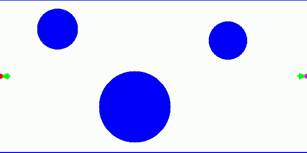
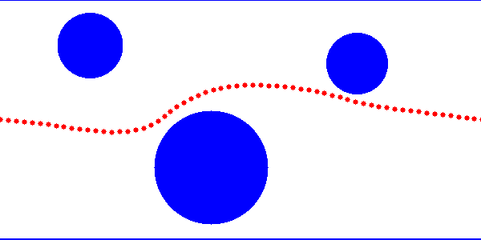

# Bi - directional A* and Potential Field Algorithms

This repository contains implementations of two path planning algorithms:

    Bidirectional A Algorithm (bidirectional-astar.py)
    Potential Field Path Planning (potential_field.py)

Both scripts visualize their respective algorithms using OpenCV.
Dependencies

Ensure you have the following Python libraries installed before running the scripts:

```
pip install numpy opencv-python
```

## Files Overview

### 1. Bidirectional-astar.py

This script implements the Bidirectional A Algorithm* for path planning.
It uses two simultaneous A* searches from the start and goal positions. The environment consists of predefined obstacles, and a video visualization is generated to show the search process. Outputs an MP4 video of the explored path.

#### Usage

Run the script using:

```
python3 bidirectional-astar.py
```

Ensure that the output/ directory exists to store the generated video.

### 2. potential_field.py

This script implements Potential Field Path Planning, a gradient-based approach:

The goal exerts an attractive force, while obstacles exert repulsive forces. The agent moves based on the resultant force vector. The path is visualized using OpenCV.

#### Usage

Run the script using:

```
python3 potential_field.py
```

### Output

The output of the scripts will be saved in the `output/` directory. The following files will be generated:

- `bidirectional-astar.mp4`: Video of the explored path using the Bidirectional A* Algorithm.



- `potential_field.png`: Image showing the path generated by the Potential Field Path Planning.


